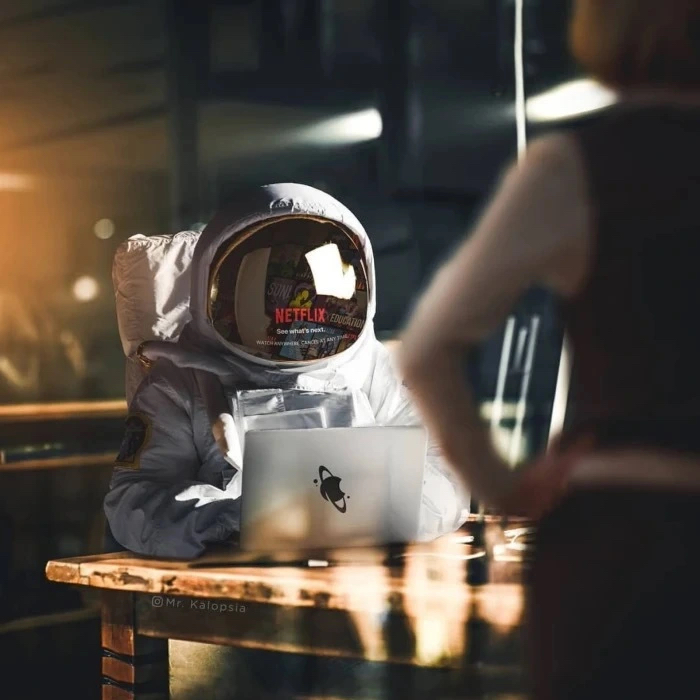
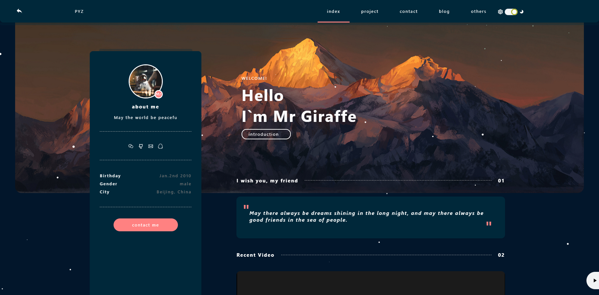
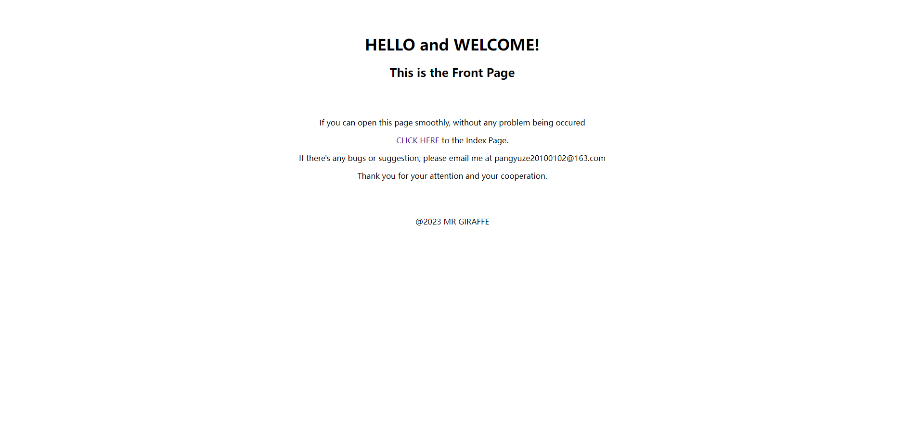

# Mrgiraffe0102.github.io
## Instruction
This is a personal website based on an opensource project provided by *wttAndroid*(https://gitee.com/wttAndroid).  
I'm *MrGiraffe*, an active web developer and 3d designer.  

## Online Preview
* https://mrgiraffe0102.github.io/ ——Index Page  

* https://mrgiraffe0102.github.io/front.html ——Front Page  

## Read INSTALL
* HTTPS: *https://github.com/Mrgiraffe0102/Mrgiraffe0102.github.io.git*
* SSH: *git@github.com:Mrgiraffe0102/Mrgiraffe0102.github.io.git*
* GitHub CLI: *gh repo clone Mrgiraffe0102/Mrgiraffe0102.github.io*
## How to arrange
Run 'index.html' directly
## Technology Preview
* paper-full.min
## Read AUTHORS
* *wttAndroid*(https://gitee.com/wttAndroid), providing source code  
* *Mr姚*, participated in building the website
## Contact Info.
Please email me at *pangyuze20100102@163.com* or *pangyuze20100102@gmail.com*.
## Updating Data
(none)
## Legal Info.
This file is no longer open source since May30, 2023!!!  
Was already used as my IT class homework!!  
License under *GNU General Public License v3.0*, for more, check out at /LICENSE or https://github.com/Mrgiraffe0102/Mrgiraffe0102.github.io/blob/main/LICENSE  
Thankyou very much for your attention and constant support,  
Please visit *https://gitee.com/wttAndroid/web-resume-resume* for Upstream Files.
## File Layout
Mrgiraffe0102.github.io-main  
|  
|——css  
|&emsp;&emsp;&emsp;|——base.css  
|&emsp;&emsp;&emsp;|——blog.css  
|&emsp;&emsp;&emsp;|——contact.css  
|&emsp;&emsp;&emsp;|——fly.css  
|&emsp;&emsp;&emsp;|——font-awesome.min.css  
|&emsp;&emsp;&emsp;|——home.css  
|&emsp;&emsp;&emsp;|——index1.css  
|&emsp;&emsp;&emsp;|——live.css  
|&emsp;&emsp;&emsp;|——prism-line-numbers.css  
|&emsp;&emsp;&emsp;|——prism.css  
|&emsp;&emsp;&emsp;|——resume.css  
|  
|——img  
|&emsp;&emsp;&emsp;|——back  
|&emsp;&emsp;&emsp;|&emsp;&emsp;&emsp;|——94a9629e7e9f46b08225213f0ac05064.png  
|&emsp;&emsp;&emsp;|&emsp;&emsp;&emsp;|——94a9629e7e9f46b08225213f0ac05064_min.png  
|&emsp;&emsp;&emsp;|&emsp;&emsp;&emsp;|——a58cbbffd2aa49c1b1e99990be912f30.jpg  
|&emsp;&emsp;&emsp;|&emsp;&emsp;&emsp;|——a58cbbffd2aa49c1b1e99990be912f30_min.jpg  
|&emsp;&emsp;&emsp;|&emsp;&emsp;&emsp;|——aitx6-0og08.webp  
|&emsp;&emsp;&emsp;|&emsp;&emsp;&emsp;|——augh8-4zagg.webp  
|&emsp;&emsp;&emsp;|——live  
|&emsp;&emsp;&emsp;|&emsp;&emsp;&emsp;|——Tsinghua University.jpg  
|&emsp;&emsp;&emsp;|——logo  
|&emsp;&emsp;&emsp;|&emsp;&emsp;&emsp;|——GitHub-logo.png  
|&emsp;&emsp;&emsp;|&emsp;&emsp;&emsp;|——MrY.jpg  
|&emsp;&emsp;&emsp;|&emsp;&emsp;&emsp;|——toux.jpg  
|&emsp;&emsp;&emsp;|——project  
|&emsp;&emsp;&emsp;|&emsp;&emsp;&emsp;|——Mypersonalwebsite.png  
|&emsp;&emsp;&emsp;|——20181205202825_CmrWi.gif  
|&emsp;&emsp;&emsp;|——20190914143645_oxitt.gif  
|&emsp;&emsp;&emsp;|——bg2.jpg  
|&emsp;&emsp;&emsp;|——bg10.png  
|&emsp;&emsp;&emsp;|——clip_image002.jpg  
|&emsp;&emsp;&emsp;|——front.png  
|&emsp;&emsp;&emsp;|——index.png  
|&emsp;&emsp;&emsp;|——music.MP3  
|&emsp;&emsp;&emsp;|——PYZ.jpg  
|&emsp;&emsp;&emsp;|——timg.gif  
|&emsp;&emsp;&emsp;|——timg2.gif  
|&emsp;&emsp;&emsp;|——video.mp4  
|&emsp;&emsp;&emsp;|——videoback.jpg  
|  
|——js  
|&emsp;&emsp;&emsp;|——base.js  
|&emsp;&emsp;&emsp;|——canvas.js  
|&emsp;&emsp;&emsp;|——index1.js  
|&emsp;&emsp;&emsp;|——jq.js  
|&emsp;&emsp;&emsp;|——jquery.min.js  
|&emsp;&emsp;&emsp;|——marked.js  
|&emsp;&emsp;&emsp;|——paper-full.min.js  
|&emsp;&emsp;&emsp;|——prism.js  
|&emsp;&emsp;&emsp;|——qrcode.js  
|&emsp;&emsp;&emsp;|——resume.js  
|  
|——blog.html  
|——contact.html  
|——front.html  
|——home.html  
|——index.html  
|——live.html  
|——showmd.html  
|——README.md  
(7 html pages, 3 folders, 53 files, 92.3mb in total)
***
2023@MR GIRAFFE, all rights reserved
